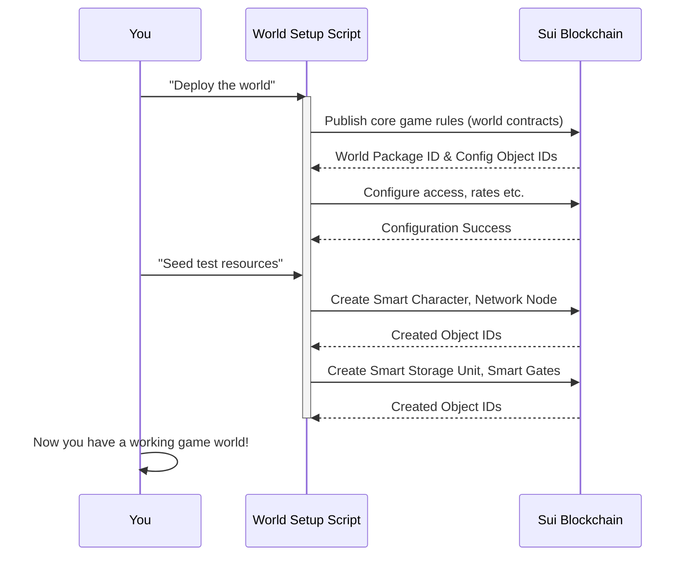

# Chapter 1: EVE Frontier World (Smart Assemblies)

Welcome, aspiring builder, to the EVE Frontier! This first chapter is your gateway into understanding the very foundation of this exciting universe: the **EVE Frontier World** and its special components, **Smart Assemblies**.

Imagine building a vast, interactive online game where the entire world, every item, every character, and every rule, lives directly on a blockchain. This isn't just a vision; it's what EVE Frontier achieves! Our goal in this chapter is to give you a clear picture of how this "blockchain game world" is set up and why it's so powerful for builders like you.

## What is the EVE Frontier World?

At its heart, the EVE Frontier World is the entire game universe brought to life on the **Sui blockchain**. Think of it as a massive digital playground where all the core game elements are not just stored, but *actually exist and operate* directly on the blockchain.

This is a big deal because it means the game's rules are transparent, its assets are truly owned by players, and its state is always verifiable. It's the foundational "game engine" that runs in a decentralized way.

## Meet "Smart Assemblies"

So, how is this blockchain world built? It's made up of special on-chain objects called **Smart Assemblies**.

Imagine you're playing with advanced LEGOs. Instead of just dumb bricks, these are "smart" LEGO pieces. Each Smart Assembly is a unique, programmable piece of the game world, like a **Smart Character** (your in-game identity), a **Smart Gate** (a jump point between locations), or a **Smart Storage Unit** (where you keep your valuable items).

These Smart Assemblies are the core building blocks of EVE Frontier. They have built-in behaviors and rules, forming the essential features of the game.

## Why is this important for you, the Builder?

Understanding Smart Assemblies is like understanding the basic physics and mechanics of the game world. As a builder, you're not just playing *in* the world; you're building *on top of it*. This means you'll be able to:

1.  **Interact** with existing Smart Assemblies (e.g., jump through a Smart Gate, deposit items into a Smart Storage Unit).
2.  **Extend** existing Smart Assemblies with your own custom behaviors (e.g., creating a special Smart Gate that only allows certain players, or a Storage Unit that offers unique crafting services).
3.  **Create** entirely new Smart Assemblies that fit seamlessly into the EVE Frontier ecosystem.

This chapter focuses on the first step: understanding how the foundational world, with its core Smart Assemblies, is deployed and structured. This knowledge is essential before you can start extending or building new parts of it!

## How the EVE Frontier World is Deployed

To start building, you first need a working EVE Frontier World to interact with. For development, we "deploy" a miniature version of this world onto a local or test network. This process involves two main steps:

1.  **Deploying the World Contracts:** This sets up the fundamental rules and core logic of the EVE Frontier universe on the blockchain. It's like laying down the main game board and defining how all the game pieces will move and interact.
2.  **Seeding Test Resources:** Once the world's rules are in place, we "seed" it with initial Smart Assemblies – the basic game assets you need to start playing and building. This includes a character for you, some storage, and a few gates.

Let's look at the process conceptually:


*Note: The "World Setup Script" here refers to the helper scripts in the `setup-world/` directory, which automate these blockchain actions for you.*

### Deployment in Practice

When you follow the [Docker Development Environment](05_docker_development_environment_.md) or [Host Development Environment](05_docker_development_environment_.md) guides in the `builder-scaffold` project, you'll use commands like these (from `setup-world/readme.md`):

```bash
# This command deploys the core EVE Frontier world contracts to your local network.
# It sets up the foundational game logic and initial configurations.
pnpm deploy-world localnet
```

After the `deploy-world` step, the core rules and configurations of EVE Frontier are live on the blockchain. You don't see characters or gates yet, just the "engine."

Next, you "seed" the world:

```bash
# This command creates initial Smart Assemblies like your character,
# a network node, storage units, and gates, making the world interactive.
pnpm create-test-resources localnet
```

This `create-test-resources` command is crucial because it brings the Smart Assemblies mentioned earlier into existence on the blockchain!

### What gets created?

After seeding, you'll have these essential Smart Assemblies on your `localnet` (or `testnet`):

| Smart Assembly      | Purpose                                                                |
| :------------------ | :--------------------------------------------------------------------- |
| **Smart Character** | Your on-chain identity; owns all your other assemblies.                |
| **Network Node**    | The power source that generates energy for your other assemblies.      |
| **Smart Storage Unit** | A place to store items, fully on-chain.                                |
| **Smart Gates**     | Two linked gates, allowing your character to "jump" between locations. |

These are the fundamental game objects you'll interact with as you begin building.

### Tracking Your Deployed World

When you deploy and seed the world, the `builder-scaffold` copies important information into a `deployments` folder, specifically in files like `extracted-object-ids.json` and `test-resources.json`. These files contain the unique **Object IDs** of all the Smart Assemblies and core contracts you just created on the blockchain.

Think of an Object ID as the unique address or serial number for each Smart Assembly on the blockchain. When you want to interact with a specific Smart Gate or your Smart Character, you'll need its Object ID.

Here's a simplified look at what `extracted-object-ids.json` might contain (from `ts-scripts/utils/config.ts` context):

```typescript
// A simplified view of the 'extracted-object-ids.json' structure
type ExtractedObjectIds = {
    network: string; // e.g., "localnet"
    world: {
        packageId: string; // The ID of the core EVE Frontier game logic
        governorCap: string; // Control token for the game world
        objectRegistry: string; // Tracks all Smart Assemblies
        // ... many other important IDs for core world components ...
    };
    // ... potentially other builder-specific package IDs later ...
};
```

This `extracted-object-ids.json` file is a map to your deployed world. It tells your scripts and applications exactly where to find the main game logic (`packageId`) and all the essential shared components that make up the EVE Frontier World.

For instance, your `ts-scripts/utils/config.ts` uses this information to connect to your deployed world:

```typescript
// In ts-scripts/utils/config.ts, this function loads the IDs
import path from "node:path";

export const EXTRACTED_OBJECT_IDS_FILENAME = "extracted-object-ids.json";

export function getExtractedObjectIdsPath(network: string): string {
    // This function tells us where to find the JSON file with all the IDs
    // Example path: builder-scaffold/deployments/localnet/extracted-object-ids.json
    return path.resolve(process.cwd(), "deployments", network, EXTRACTED_OBJECT_IDS_FILENAME);
}

// Later, other scripts will read this file to get the 'packageId'
// and IDs of various Smart Assemblies to interact with them.
```
This snippet shows how the system internally knows where to look for the deployment details. The actual loading and parsing of this JSON file happens within the `builder-scaffold`'s utility scripts, allowing your interaction scripts to easily reference the deployed Smart Assemblies.

## Conclusion

You've just taken your first step into understanding the EVE Frontier World! You now know that it's a game universe built directly on the Sui blockchain, composed of intelligent, on-chain objects called Smart Assemblies. You also learned that deploying this world involves setting up its core logic and then populating it with essential game assets like characters and gates, with all their unique Object IDs recorded for you.

This foundational understanding is crucial because it's the canvas upon which you'll paint your own creations. In the next chapter, we'll dive into how you can start building your own custom logic and extending these core Smart Assemblies using **Move Contracts & Extensions**.

[Next Chapter: Move Contracts & Extensions](02_move_contracts___extensions_.md)

---

<sub><sup>Generated by [AI Codebase Knowledge Builder](https://github.com/The-Pocket/Tutorial-Codebase-Knowledge).</sup></sub> <sub><sup>**References**: [[1]](https://github.com/evefrontier/builder-scaffold/blob/ebc321a760e3701954e3d445fa92fe881267ea94/README.md), [[2]](https://github.com/evefrontier/builder-scaffold/blob/ebc321a760e3701954e3d445fa92fe881267ea94/move-contracts/readme.md), [[3]](https://github.com/evefrontier/builder-scaffold/blob/ebc321a760e3701954e3d445fa92fe881267ea94/setup-world/readme.md), [[4]](https://github.com/evefrontier/builder-scaffold/blob/ebc321a760e3701954e3d445fa92fe881267ea94/ts-scripts/utils/config.ts)</sup></sub>