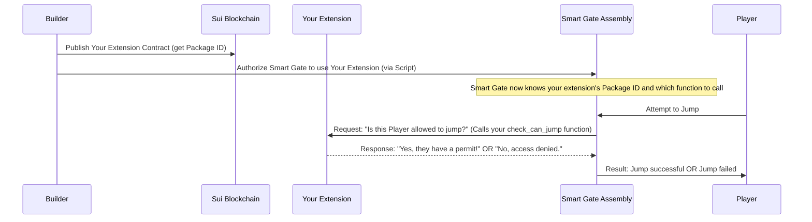

# Chapter 2: Move Contracts & Extensions

Welcome back, builder! In [Chapter 1: EVE Frontier World (Smart Assemblies)](01_eve_frontier_world__smart_assemblies__.md), we explored the foundational elements of the EVE Frontier World: the **Smart Assemblies** like Smart Characters and Smart Gates. You learned that these are the core, pre-built components that make up the game world on the Sui blockchain.

But what if you want to add your *own* unique rules or change how these core components behave? What if you want to build a Smart Gate that only lets certain players jump through, or a Smart Storage Unit that gives out special rewards? This is where **Move Contracts & Extensions** come in!

## The Need for Custom Rules

Imagine your basic Smart Gate. It works, it lets players jump. But in a vast, evolving frontier, you'll want more than just basic functionality. You'll want to:

*   **Add new features:** Perhaps a "toll" system for your Smart Gate.
*   **Change existing behavior:** Make a Smart Storage Unit only accessible during certain times.
*   **Create entirely new game mechanics:** Implement a "quest giver" Smart Assembly.

The core game provides robust foundations, but as a builder, you need the tools to innovate and create custom logic. That's exactly what Move Contracts and Extensions empower you to do.

## What are Move Contracts & Extensions?

Let's break down these two key concepts:

### The Move Language: Your Blueprint for the Blockchain

First, you need a way to write these custom rules. This is done using the **Move language**.

Think of Move as a special, super-secure programming language built specifically for writing programs that live on a blockchain. It's designed to manage digital assets and define their behaviors very safely and reliably.

When you write a program in the Move language, it's called a **Move Contract**. These contracts are like digital blueprints that define new kinds of digital items or how existing items should behave on the blockchain.

### Extensions: Plug-and-Play Upgrades for Smart Assemblies

Now, how do your custom Move Contracts connect to the existing EVE Frontier World? Through **Extensions**!

Remember the **Smart Assemblies** from [Chapter 1](01_eve_frontier_world__smart_assemblies__.md)? Extensions are a specific type of Move Contract designed to "plug into" and enhance these existing Smart Assemblies.

Imagine your Smart Gate is like a sturdy, standard computer. An Extension is like a specialized software program or an upgrade module you install on that computer. This upgrade adds new functionalities or changes how the computer (or Smart Gate) operates. For example, it could add new jumping rules to a Smart Gate or introduce unique crafting behaviors to a Smart Storage Unit.

**In essence, Extensions allow you to customize and expand the game logic *directly on the blockchain*, making your creations truly unique and deeply integrated into the EVE Frontier World.**

## How Builders Use Extensions: A Smart Gate Example

Let's walk through a concrete example: customizing a **Smart Gate** with a "Tribe Permit" rule. This rule will only allow players from a specific "Tribe" to jump through the gate.

Here’s the basic journey for a builder using Extensions:

1.  **Write Your Extension Contract:** You write Move code that outlines your custom "Tribe Permit" logic.
2.  **Build Your Extension:** You compile your Move code into a format that the blockchain understands.
3.  **Publish Your Extension:** You deploy your compiled extension onto the Sui blockchain. This gives it a unique **Package ID**.
4.  **Connect to a Smart Assembly:** You tell an existing Smart Gate to use your newly published extension.
5.  **Interact with New Rules:** Now, when players try to jump through that Smart Gate, your extension's "Tribe Permit" rule springs into action!

Let's see these steps in action using the `builder-scaffold` project's examples.

### Step 1 & 2: Writing and Building Your Extension

The `builder-scaffold` provides example extensions in the `move-contracts/` directory. The `smart_gate_extension/` folder contains an example that implements the "Tribe Permit" logic.

To compile this example, you would navigate into its directory and use the `sui move build` command:

```bash
# 1. Navigate to the extension's folder
cd move-contracts/smart_gate_extension

# 2. Build the extension
sui move build -e testnet
```
*What this does:* This command takes your Move code, checks it for any errors, and translates it into a low-level format called "bytecode" that the Sui blockchain can execute. The `-e testnet` part ensures that any dependencies (like the core EVE Frontier world contracts) are correctly resolved during the build process.

### Step 3: Publishing Your Extension to the Blockchain

After building, you publish your extension. This makes it a live program on the blockchain and assigns it a unique **Package ID**.

Remember from [Chapter 1: EVE Frontier World (Smart Assemblies)](01_eve_frontier_world__smart_assemblies__.md) that every important piece of data or program on the blockchain has a unique ID? Your newly published extension will receive its own `packageId`!

For our local development network, the command to publish is:

```bash
# While still inside 'move-contracts/smart_gate_extension/'
sui client test-publish --build-env testnet --pubfile-path ../../deployments/localnet/Pub.localnet.toml
```
*What this does:* This command sends your compiled extension bytecode to your local Sui blockchain. The `--pubfile-path` option is very important here; it helps the local network understand where to find the `packageId` of the core EVE Frontier World contracts (which your extension might depend on). Once published, the blockchain returns a unique `packageId` for your extension, which you'll need for the next steps!

### Step 4: Connecting Your Extension to a Smart Assembly

Publishing your extension makes it available on the blockchain, but it's not automatically *active* on any Smart Gate. You need to explicitly tell a specific Smart Gate to start using your extension. This "connection" is often done using a **TypeScript Interaction Script**, which we'll cover in detail in [Chapter 3: TypeScript Interaction Scripts](03_typescript_interaction_scripts_.md).

The `builder-scaffold` includes a script specifically for this purpose:

```bash
# This command authorizes a Smart Gate to use your new extension
pnpm authorise-gate-extension
```
*What this does:* This command runs a TypeScript script that calls a special function on one of the Smart Gates you created in [Chapter 1](01_eve_frontier_world__smart_assemblies__.md). It passes the `packageId` of your newly published extension (from Step 3) to the Smart Gate, effectively "plugging in" your custom rules and telling the gate, "Hey, from now on, use *this* extension for your jumping logic!"

### Step 5: Interacting with the New Rules

Once your extension is authorized, any interaction with that specific Smart Gate will now involve your custom logic. For instance, if your extension adds a `tribe_permit` rule, a player attempting to jump might first need to acquire this permit:

```bash
# Example script to issue a jump permit (this would typically be part of a dApp)
pnpm issue-tribe-jump-permit

# Example script to attempt a jump using the permit
pnpm jump-with-permit
```
*What this does:* These commands execute TypeScript scripts that simulate a player interacting with the game. When `pnpm jump-with-permit` is called, the Smart Gate doesn't just allow the player to jump immediately. Instead, it *first consults your extension* to see if the player meets the `tribe_permit` criteria. If your extension confirms the permit, the jump proceeds. If not, the jump is denied, based on your custom rule!

## Under the Hood: How Extensions Talk to Smart Assemblies

How does a Smart Gate "know" to call your extension and check for a `tribe_permit`? This seamless interaction is a core part of the EVE Frontier's extensibility design.

Here’s a simplified sequence diagram showing this interaction:



### The "Typed Witness Pattern" (Simplified)

The technical method that enables this secure and reliable communication between a Smart Assembly and an Extension is often referred to as the **"Typed Witness Pattern"**. Don't let the name intimidate you; it's a clever way for different Move contracts to safely interact without needing to know all the inner workings of each other.

Imagine the Smart Gate has a special, specific "slot" or "hook" for new rules. When you authorize your extension, you provide a unique "key" or "witness" that fits into that slot. This "key" tells the Smart Gate: "Hey, when you need to decide if a player can jump, don't use your default logic. Instead, call *this specific function* (e.g., `check_can_jump_with_permit`) from *my* extension at *this Package ID*."

Your extension contract (written in Move) defines these specific functions that the Smart Gate will call. For example, in the `smart_gate_extension` example, there's a module called `tribe_permit`:

```move
// Simplified example from move-contracts/smart_gate_extension/sources/tribe_permit.move
module smart_gate_extension::tribe_permit {

    // This is a special "witness" or "key" that the Smart Gate recognizes
    public struct TRIBE_PERMIT_WITNESS has drop {}

    // This is the function that the Smart Gate will call to check the rule
    public fun check_can_jump_with_permit(...) {
        // ... your custom logic to check if a player has a tribe permit ...
        // This function will return 'true' if allowed, or 'false' if not.
    }

    // Other functions like 'issue_tribe_jump_permit' would also be here
    public fun issue_tribe_jump_permit(...) { /* ... */ }
}
```
*What this simplified code means:* The `TRIBE_PERMIT_WITNESS` is like the special tag your extension wears, telling the Smart Gate, "I'm the one who handles tribe permits." The `check_can_jump_with_permit` function is the actual instruction set – your custom game rule – that the Smart Gate will execute when it needs to make a jumping decision.

The `builder-scaffold`'s TypeScript scripts (which you'll learn about in the next chapter) internally use this pattern. When you run `pnpm authorise-gate-extension`, it essentially passes this `TRIBE_PERMIT_WITNESS` and your extension's `packageId` to the Smart Gate, establishing the connection and making your custom rules active.

## Conclusion

You've just uncovered the power of **Move Contracts & Extensions**! You now understand that they are custom programs written in the secure Move language that allow you to define new game rules and add functionalities to the EVE Frontier World's Smart Assemblies. You've walked through the process of building, publishing, and attaching an example Smart Gate Extension to customize its jumping behavior, learning that your extension's unique `packageId` and specific functions are the keys to its interaction with the game world.

This ability to extend and modify core game components directly on the blockchain is incredibly powerful, unlocking endless possibilities for you as a builder to innovate and create truly unique experiences. In the next chapter, we'll dive into how you can use **TypeScript Interaction Scripts** to easily interact with these deployed Smart Assemblies and your custom Extensions, making it simple to test and integrate your creations.

[Next Chapter: TypeScript Interaction Scripts](03_typescript_interaction_scripts_.md)

---

<sub><sup>Generated by [AI Codebase Knowledge Builder](https://github.com/The-Pocket/Tutorial-Codebase-Knowledge).</sup></sub> <sub><sup>**References**: [[1]](https://github.com/evefrontier/builder-scaffold/blob/ebc321a760e3701954e3d445fa92fe881267ea94/CONTRIBUTING.md), [[2]](https://github.com/evefrontier/builder-scaffold/blob/ebc321a760e3701954e3d445fa92fe881267ea94/move-contracts/readme.md), [[3]](https://github.com/evefrontier/builder-scaffold/blob/ebc321a760e3701954e3d445fa92fe881267ea94/ts-scripts/smart_gate_extension/modules.ts), [[4]](https://github.com/evefrontier/builder-scaffold/blob/ebc321a760e3701954e3d445fa92fe881267ea94/ts-scripts/smart_gate_extension/readme.md)</sup></sub>