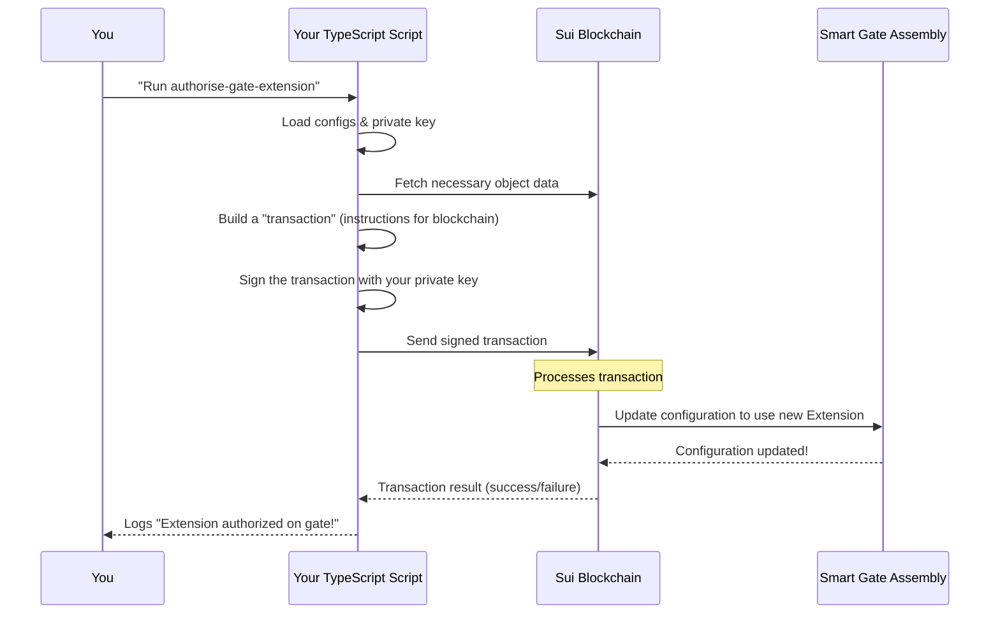

# Chapter 3: TypeScript Interaction Scripts

Welcome back, builder! In [Chapter 1: EVE Frontier World (Smart Assemblies)](01_eve_frontier_world__smart_assemblies__.md), you learned about the core game components like Smart Characters and Smart Gates living on the Sui blockchain. Then, in [Chapter 2: Move Contracts & Extensions](02_move_contracts___extensions_.md), you discovered how to create your own custom game rules using Move Extensions and publish them to the blockchain.

Now, a crucial question arises: How do we actually *talk* to these deployed Smart Assemblies and our custom Extensions from our local development machine? How do we tell a Smart Gate to use our new Extension, or simulate a player jumping through it?

This is where **TypeScript Interaction Scripts** come in!

## Your Remote Control for the Blockchain

Imagine you've built a super cool robot (your Smart Assembly with an Extension) and placed it in a giant arena (the EVE Frontier World on the blockchain). Now you need a remote control to tell it what to do, configure its settings, or make it perform actions.

**TypeScript Interaction Scripts are exactly that: your remote control for the EVE Frontier World on the blockchain.**

They are automated programs, written in TypeScript, that allow you to:

*   **Deploy** new contracts (like the EVE Frontier World itself or your Extensions).
*   **Configure** game rules or settings on existing Smart Assemblies.
*   **Simulate** player actions (e.g., a character jumping through a gate, depositing items).
*   **Test** if everything works as expected, without manual clicks or complex blockchain commands.

They automate all the complex steps of interacting with a blockchain, making development and testing much smoother.

## Why TypeScript for Interaction Scripts?

You might be wondering, "Why TypeScript?" Here's why it's a great choice for these scripts:

*   **Familiarity:** Many developers are already familiar with JavaScript/TypeScript, making it easier to jump in.
*   **Type Safety:** TypeScript helps catch errors *before* your code runs, preventing common mistakes when dealing with complex blockchain data.
*   **Sui SDK:** The Sui blockchain provides an excellent JavaScript/TypeScript Software Development Kit (SDK), making it straightforward to build transactions and interact with the network.
*   **Readability:** Scripts written in TypeScript are generally easier to read and understand than raw blockchain commands.

The `builder-scaffold` project provides a dedicated `ts-scripts/` directory where these interaction scripts live.

## Our Use Case: Authorizing a Smart Gate Extension

Let's revisit our example from [Chapter 2: Move Contracts & Extensions](02_move_contracts___extensions_.md). We built a "Tribe Permit" Extension for a Smart Gate. To make that Extension active, we need to *authorize* a specific Smart Gate to use it. This is a perfect job for a TypeScript Interaction Script!

The `builder-scaffold` includes a script specifically for this: `authorise-gate-extension.ts`.

### How to Run an Interaction Script

To run this script, you would typically use a command like this from the root of your `builder-scaffold` project:

```bash
pnpm authorise-gate-extension
```

*What this does:* The `pnpm` command looks into the project's `package.json` file for a script named `authorise-gate-extension`. This script entry then tells `pnpm` to execute the corresponding TypeScript file using `ts-node` (a tool that runs TypeScript directly).

Here's a simplified view of what that `package.json` entry might look like:

```json
// In package.json (simplified)
{
  "scripts": {
    "authorise-gate-extension": "ts-node ts-scripts/smart_gate_extension/authorise-gate-extension.ts"
  }
}
```
*What this simplified code means:* When you type `pnpm authorise-gate-extension`, it executes the TypeScript file `ts-scripts/smart_gate_extension/authorise-gate-extension.ts`.

When you run this command, the script will:

1.  Load your private key (from your `.env` file) to sign the transaction.
2.  Find the Object ID of your deployed Smart Gate and the Package ID of your "Tribe Permit" Extension.
3.  Create a blockchain transaction that calls a special function on the Smart Gate.
4.  Send this transaction to the Sui blockchain.

Once the transaction is processed, your Smart Gate is now configured to use your custom Extension!

## Inside the Script: A Peek at `authorise-gate-extension.ts`

Let's look at the core of what the `authorise-gate-extension.ts` script does. Don't worry about every detail; focus on the main steps.

```typescript
// ts-scripts/smart_gate_extension/authorise-gate-extension.ts (simplified main function)
async function main() {
    console.log("============= Authorise Gate Extension ==============\n");
    try {
        // 1. Get environment configuration (e.g., network, RPC URL)
        const env = getEnvConfig();

        // 2. Load your private key to sign the transaction
        const playerKey = requireEnv("PLAYER_A_PRIVATE_KEY");

        // 3. Initialize connection to the Sui blockchain
        const ctx = initializeContext(env.network, playerKey);

        // 4. Load IDs of deployed world contracts and test resources
        await hydrateWorldConfig(ctx);

        // 5. Call the function that actually creates and sends the transaction
        //    This tells a specific gate (GATE_ITEM_ID_1) to use the extension.
        await authoriseGate(ctx, GATE_ITEM_ID_1, BigInt(GAME_CHARACTER_ID));
        console.log("Gate 1 authorized!");

        // The script can authorize multiple gates if needed
        await authoriseGate(ctx, GATE_ITEM_ID_2, BigInt(GAME_CHARACTER_ID));
        console.log("Gate 2 authorized!");

    } catch (error) {
        handleError(error); // Basic error handling
    }
}

main(); // Run the main function
```
*What this simplified code means:* The `main` function is the entry point. It sets up the environment, prepares the connection to the blockchain, and then calls `authoriseGate` for each Smart Gate that needs to be configured. The `authoriseGate` function (which we'll explore briefly later) is where the actual blockchain transaction is constructed and sent.

## Under the Hood: How Scripts Talk to the Blockchain

Let's break down the general flow of how these TypeScript scripts interact with the Sui blockchain.

### High-Level Flow

When you run an interaction script, here's a conceptual step-by-step process:

1.  **Preparation:** The script first gets ready. This involves reading configuration like which network to connect to (`localnet`, `testnet`), and loading your secret **private key** (which allows the script to prove it's *you* sending instructions).
2.  **Locate Assets:** It consults a special "address book" (`extracted-object-ids.json` in your `deployments` folder) to find the unique **Object IDs** and **Package IDs** of the Smart Assemblies and Extensions you want to interact with.
3.  **Build a Transaction:** The script then constructs a "transaction." Think of a transaction as a sealed envelope containing a set of instructions for the blockchain. For our use case, this instruction is: "Hey Smart Gate, please start using this specific Extension!"
4.  **Sign the Transaction:** Using your private key, the script "signs" this envelope. This signature proves that the transaction came from you and authorizes the actions within it.
5.  **Send to Blockchain:** The signed transaction (the sealed and signed envelope) is then sent to the Sui blockchain.
6.  **Blockchain Processing:** The Sui blockchain receives the transaction, verifies your signature, and executes the instructions. In our case, it updates the Smart Gate's configuration to include your Extension.

Here's a simplified sequence diagram:



### Deeper Dive into Script Components

Let's look at a few key parts of how these scripts are implemented in the `builder-scaffold`:

#### 1. Initializing the Context

The `initializeContext` function is crucial. It sets up the connection to the Sui network and loads your private key.

```typescript
// ts-scripts/utils/helper.ts (simplified)
export function initializeContext(network: Network, privateKey: string): InitializedContext {
    // Connects to the Sui blockchain using the provided network (e.g., localnet)
    const client = createClient(network);

    // Creates a keypair from your private key (from .env)
    const keypair = keypairFromPrivateKey(privateKey);

    // Gets your Sui address from the keypair
    const address = keypair.getPublicKey().toSuiAddress();

    return { client, keypair, config, address, network };
}
```
*What this simplified code means:* This function prepares everything needed to interact with the Sui blockchain: `client` (your connection), `keypair` (your identity for signing), and `address` (your public ID on Sui).

#### 2. Hydrating World Configuration

Scripts need to know the unique IDs of the deployed core EVE Frontier World contracts and your custom Extensions. This information is stored in JSON files in the `deployments/` folder. The `hydrateWorldConfig` function loads these IDs.

```typescript
// ts-scripts/utils/helper.ts (simplified)
export async function hydrateWorldConfig(ctx: InitializedContext): Promise<HydratedWorldConfig> {
    const network = ctx.network;
    // Loads the deployments/localnet/extracted-object-ids.json file
    const extracted = loadExtractedObjectIds(network);
    if (!extracted?.world) {
        throw new Error(`Missing extracted-object-ids.json. Deploy world-contracts first.`);
    }
    // Update the script's configuration with the loaded IDs
    ctx.config = { ...ctx.config, ...extracted.world } as WorldConfig;

    return ctx.config as HydratedWorldConfig;
}
```
*What this simplified code means:* This function reads the `extracted-object-ids.json` file (which you first created when deploying the EVE Frontier World in [Chapter 1](01_eve_frontier_world__smart_assemblies__.md)). This file acts as a directory, providing all the necessary **Package IDs** and **Object IDs** for core world components.

You can see an example of this file structure in `ts-scripts/utils/config.ts`:

```typescript
// ts-scripts/utils/config.ts (simplified ExtractedObjectIds type)
type ExtractedObjectIds = {
    network: string; // e.g., "localnet"
    world: {
        packageId: string; // The ID of the core EVE Frontier game logic
        governorCap: string;
        objectRegistry: string; // Tracks all Smart Assemblies
        // ... many other important IDs ...
    };
    builder?: { // Your builder-specific extensions will go here
        packageId: string;
        extensionConfigId: string;
        // ...
    };
};
```
*What this simplified code means:* This `ExtractedObjectIds` type shows how the `builder-scaffold` organizes all the important IDs. When `hydrateWorldConfig` runs, it populates your script's `ctx.config` with these specific IDs, allowing your script to correctly identify and interact with the right objects on the blockchain. We'll delve deeper into how these Object IDs are derived and used in the next chapter!

#### 3. Building and Executing the Transaction

Finally, let's look at the heart of `authoriseGate`: building and sending the blockchain transaction.

```typescript
// ts-scripts/smart_gate_extension/authorise-gate-extension.ts (simplified authorizeGate function)
import { Transaction } from "@mysten/sui/transactions";
// ... other imports ...

async function authoriseGate(
    ctx: ReturnType<typeof initializeContext>,
    gateItemId: bigint,
    characterItemId: bigint
) {
    const { client, keypair, config, address } = ctx;
    const builderPackageId = requireBuilderPackageId(); // Gets your Extension's Package ID

    // Use Object IDs from the config and derive the specific gate/character IDs
    // (We will learn more about deriveObjectId in Chapter 4)
    const characterId = deriveObjectId(config.objectRegistry, characterItemId, config.packageId);
    const gateId = deriveObjectId(config.objectRegistry, gateItemId, config.packageId);

    const tx = new Transaction(); // Start building a new transaction

    // Step 1: Borrow the gate's "owner cap" from your character
    // This is a special permission token needed to modify the gate.
    const [gateOwnerCap, returnReceipt] = tx.moveCall({
        target: `${config.packageId}::${MODULES.CHARACTER}::borrow_owner_cap`,
        // ... arguments ...
    });

    // Step 2: Call the Smart Gate's "authorize_extension" function
    // This tells the gate to use your new extension.
    tx.moveCall({
        target: `${config.packageId}::${MODULES.GATE}::authorize_extension`,
        typeArguments: [`${builderPackageId}::${MODULE.CONFIG}::XAuth`], // This identifies YOUR extension
        arguments: [tx.object(gateId), gateOwnerCap], // Pass the gate ID and the permission token
    });

    // Step 3: Return the "owner cap" back to your character
    tx.moveCall({
        target: `${config.packageId}::${MODULES.CHARACTER}::return_owner_cap`,
        // ... arguments ...
    });

    // Sign and send the entire transaction to the Sui blockchain
    const result = await client.signAndExecuteTransaction({
        transaction: tx,
        signer: keypair,
        options: { showEffects: true },
    });

    console.log("Extension authorized on gate!", gateId);
    console.log("Transaction digest:", result.digest);
}
```
*What this simplified code means:*
*   `new Transaction()`: This creates an empty "shopping cart" for blockchain operations.
*   `tx.moveCall(...)`: Each `tx.moveCall` adds an item to the shopping cart. These calls correspond directly to public functions defined in the Move Contracts on the blockchain.
    *   The `target` specifies *which* Move function to call (e.g., `character::borrow_owner_cap` or `gate::authorize_extension`).
    *   `typeArguments` and `arguments` provide the necessary data for those functions, like the ID of the Smart Gate or the unique identifier of your Extension (`${builderPackageId}::${MODULE.CONFIG}::XAuth`). This `XAuth` is the "Typed Witness" from [Chapter 2](02_move_contracts___extensions_.md) that your extension provides.
*   `client.signAndExecuteTransaction()`: This is the final step where the entire "shopping cart" (transaction) is signed with your private key and sent to the Sui blockchain for processing. The `result` tells you if it was successful.

This entire process, from setting up the context to executing the transaction, allows your TypeScript script to act as a powerful, automated interface to the EVE Frontier World.

## Conclusion

You've now mastered the concept of **TypeScript Interaction Scripts**! You understand that they are your remote control for the EVE Frontier World, allowing you to automate interactions, configuration, and testing of Smart Assemblies and your custom Move Extensions. You've seen how they prepare the environment, locate necessary Object IDs, construct blockchain transactions by calling Move functions, and send them to the Sui network.

This ability to programmatically interact with the blockchain is fundamental for building, iterating, and testing your creations efficiently within the EVE Frontier. In the next chapter, we'll dive into an important detail we glimpsed today: **Object ID Derivation**, and how the `builder-scaffold` helps you reliably find the unique addresses of your deployed Smart Assemblies.

[Next Chapter: Object ID Derivation](04_object_id_derivation_.md)

---

<sub><sup>Generated by [AI Codebase Knowledge Builder](https://github.com/The-Pocket/Tutorial-Codebase-Knowledge).</sup></sub> <sub><sup>**References**: [[1]](https://github.com/evefrontier/builder-scaffold/blob/ebc321a760e3701954e3d445fa92fe881267ea94/ts-scripts/readme.md), [[2]](https://github.com/evefrontier/builder-scaffold/blob/ebc321a760e3701954e3d445fa92fe881267ea94/ts-scripts/smart_gate_extension/authorise-gate-extension.ts), [[3]](https://github.com/evefrontier/builder-scaffold/blob/ebc321a760e3701954e3d445fa92fe881267ea94/ts-scripts/utils/config.ts), [[4]](https://github.com/evefrontier/builder-scaffold/blob/ebc321a760e3701954e3d445fa92fe881267ea94/ts-scripts/utils/helper.ts)</sup></sub>