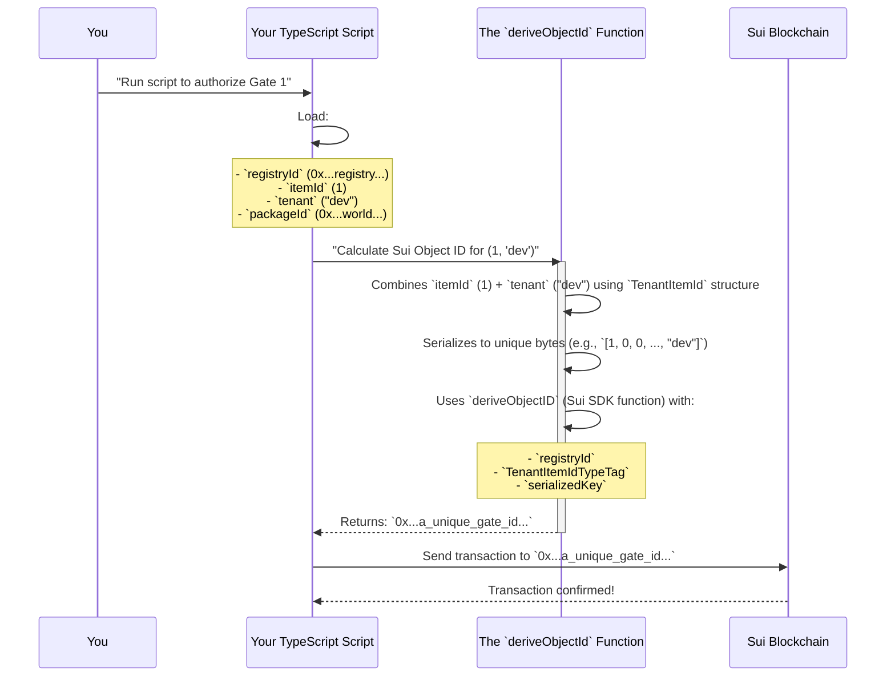

# Chapter 4: Object ID Derivation

Welcome back, builder! In [Chapter 3: TypeScript Interaction Scripts](03_typescript_interaction_scripts_.md), you learned how to use powerful TypeScript scripts as your "remote control" to interact with the EVE Frontier World on the Sui blockchain. We saw how these scripts can deploy contracts, configure Smart Assemblies, and even simulate player actions.

But there's a crucial piece missing: how does your script know *exactly which* Smart Gate or Smart Character to talk to? The Sui blockchain assigns every single object (like a gate, a character, or even an item) a very long, unique, and often unpredictable **Sui Object ID** (e.g., `0x...`). As builders, we prefer to think in terms of simple, memorable names like `GATE_ITEM_ID_1` or `GAME_CHARACTER_ID`.

This is where **Object ID Derivation** comes in! It's the clever system that helps your `builder-scaffold` scripts reliably translate those simple, friendly in-game IDs into the precise, unique Sui Object IDs needed to interact with the blockchain.

## The Challenge: Finding Your Unique Objects on Sui

Imagine you've deployed two Smart Gates, `GATE_ITEM_ID_1` and `GATE_ITEM_ID_2`, as part of your EVE Frontier World (just like we did in [Chapter 1: EVE Frontier World (Smart Assemblies)](01_eve_frontier_world__smart_assemblies__.md)). Each of these gates, even though they are the same *type* of object, has its own unique address on the blockchain – its **Sui Object ID**.

You can't just send a command to "Smart Gate 1"; you need to send it to its specific, long Sui Object ID.

The challenge is:
*   **Sui Object IDs are long and cryptic:** Hard for humans to remember or use directly.
*   **They are created dynamically:** When an object is created on the blockchain, its ID is generated. You can't just "guess" it.
*   **You need to ensure uniqueness:** What if another builder creates their own `GATE_ITEM_ID_1`? How do we prevent conflicts?

Object ID Derivation solves all these problems by providing a standardized way to *predict* and *derive* the exact Sui Object ID for any given item, based on a few known inputs.

## What is Object ID Derivation?

Object ID Derivation is a system that uses a specific formula to convert a simple "in-game item ID" (like `GATE_ITEM_ID_1`) and a "tenant" (which identifies *your specific game instance*) into a unique, unchangeable Sui Object ID.

Think of it like this: You have a universal addressing system where everyone agrees on how to calculate a unique house number based on the street name, city, and a specific identifier for the house. Even if two cities have a "Main Street," adding the city name makes the address unique.

The key pieces of information we combine to "derive" a Sui Object ID are:

| Component        | Description                                                                                                                                                                             | Example Value            |
| :--------------- | :-------------------------------------------------------------------------------------------------------------------------------------------------------------------------------------- | :----------------------- |
| **`registryId`** | The Sui Object ID of the central "Object Registry" contract. This acts as a master directory on the blockchain, helping to ensure the derivation works consistently for all objects registered with it. | `0x...registry_address...` |
| **`itemId`**     | A simple, unique number or identifier for your specific item within your game instance. This is what you define in `test-resources.json`.                                                 | `1` (for `GATE_ITEM_ID_1`) |
| **`tenant`**     | A string that identifies your specific deployment or "game instance." This is usually `dev` for local development. It's crucial for isolating your objects from other builders' objects.    | `"dev"`                  |
| **`packageId`**  | The Sui Package ID of the core EVE Frontier World contracts. This specifies where the definition of basic game IDs (`TenantItemId`) lives.                                                | `0x...world_package_id...` |

By combining these four pieces of information in a very specific way, the system can reliably calculate the exact Sui Object ID that was assigned to your object when it was first created on the blockchain.

## How Your Scripts Use Object ID Derivation

Let's go back to our example from [Chapter 3: TypeScript Interaction Scripts](03_typescript_interaction_scripts_.md) where we authorized a Smart Gate extension. To do that, the `authoriseGate` function needed the exact Sui Object ID of the Smart Gate.

```typescript
// ts-scripts/smart_gate_extension/authorise-gate-extension.ts (simplified snippet)
// ... inside the authoriseGate function ...

// Get IDs needed for derivation from our configuration
const { config } = ctx; // config contains world.packageId and world.objectRegistry
const builderPackageId = requireBuilderPackageId(); // Our extension's package ID

// Here's where Object ID Derivation happens!
const characterId = deriveObjectId(config.objectRegistry, characterItemId, config.packageId);
const gateId = deriveObjectId(config.objectRegistry, gateItemId, config.packageId);

// Now we can use the actual Sui Object IDs in our transaction
tx.moveCall({
    target: `${config.packageId}::${MODULES.GATE}::authorize_extension`,
    typeArguments: [`${builderPackageId}::${MODULE.CONFIG}::XAuth`],
    arguments: [tx.object(gateId), gateOwnerCap], // Using the derived 'gateId'!
});

// ... rest of the transaction ...
```
*What this simplified code means:* Instead of knowing `gateId` directly, we call `deriveObjectId`. We pass it the central `config.objectRegistry` (the address book), `gateItemId` (our simple `GATE_ITEM_ID_1`), and `config.packageId` (the world's core contract ID). The `deriveObjectId` function then does the heavy lifting, giving us the correct `gateId` (the actual Sui Object ID) which is then used in the `tx.moveCall` to interact with the gate.

This is extremely powerful because you, the builder, only ever need to remember the simple `GATE_ITEM_ID_1` (which is stored in your `test-resources.json` file), and the `builder-scaffold` handles the complex conversion for you.

## Under the Hood: The `deriveObjectId` Function

Let's peek inside the `builder-scaffold` to see how this derivation actually works. The core logic is in `ts-scripts/utils/derive-object-id.ts`.

### 1. Simple In-Game IDs and Tenant

First, your simple `itemId` (like `GATE_ITEM_ID_1`) and the `TENANT` value are loaded from your configuration files.

The `TENANT` is a crucial global setting defined in `ts-scripts/utils/constants.ts` (often `dev` for development):

```typescript
// ts-scripts/utils/constants.ts (simplified)
export const TENANT = process.env.TENANT || "dev"; // Default to "dev"
// ...

// Example of how GATE_ITEM_ID_1 is loaded from test-resources.json
export const GATE_ITEM_ID_1 = BigInt(res.gate.itemId1);
// ...
```
*What this simplified code means:* `TENANT` ensures that even if two different builders happen to use `itemId: 1` in their separate game deployments, their derived Sui Object IDs will be different because their `TENANT` string is unique to their environment. `GATE_ITEM_ID_1` is just a simple number (a `BigInt`) loaded from `test-resources.json`.

### 2. The `TenantItemId` Structure

Before deriving the ID, the `itemId` and `tenant` are packaged into a standard format using Sui's BCS (Binary Canonical Serialization). This creates a `TenantItemId` structure.

```typescript
// ts-scripts/utils/derive-object-id.ts (simplified)
import { bcs } from "@mysten/sui/bcs";
import { deriveObjectID } from "@mysten/sui/utils";
import { TENANT } from "./constants";

// This defines how our simple ID and tenant are combined into a standardized 'key'
const TenantItemId = bcs.struct("TenantItemId", {
    id: bcs.u64(),      // The in-game item ID (e.g., 1)
    tenant: bcs.string(), // The tenant string (e.g., "dev")
});

export function deriveObjectId(
    registryId: string,
    itemId: number | bigint,
    packageId: string
): string {
    // 1. Combine the itemId and TENANT into the TenantItemId structure
    const TenantItemIdValue = {
        id: BigInt(itemId),
        tenant: TENANT,
    };
    // 2. Serialize this structure into a byte array
    const serializedKey = TenantItemId.serialize(TenantItemIdValue).toBytes();

    // The type tag tells Sui which Move type this key represents
    const TenantItemIdTypeTag = `${packageId}::in_game_id::TenantItemId`;

    // 3. Use Sui's utility function to calculate the final Object ID
    return deriveObjectID(registryId, TenantItemIdTypeTag, serializedKey);
}
```
*What this simplified code means:*
*   `bcs.struct("TenantItemId", { ... })`: This defines a schema for how our simple `id` and `tenant` should be grouped together. It's like defining a small, standardized data packet.
*   `TenantItemId.serialize(TenantItemIdValue).toBytes()`: This takes our actual `itemId` and `TENANT` values and converts them into a compact stream of bytes. This byte stream is the unique "key" that will be used in the derivation.
*   `TenantItemIdTypeTag`: This string identifies the specific *Move type* on the blockchain that this `TenantItemId` structure corresponds to. It points to the `in_game_id` module within the core EVE Frontier `packageId`. This is important for the derivation process.

### 3. The `deriveObjectID` Magic

Finally, the `deriveObjectID` function from the Sui SDK takes these pieces and performs a cryptographic hash calculation to produce the final Sui Object ID:

```typescript
// ts-scripts/utils/derive-object-id.ts (snippet from above)
// ...
    // 3. Use Sui's utility function to calculate the final Object ID
    return deriveObjectID(registryId, TenantItemIdTypeTag, serializedKey);
}
```
*What this simplified code means:*
*   `deriveObjectID` is a special utility function provided by the Sui SDK. It takes three key inputs:
    1.  `registryId`: The Object ID of the central `objectRegistry` (from our world config).
    2.  `TenantItemIdTypeTag`: The unique string that describes the type of the key being used (`TenantItemId`).
    3.  `serializedKey`: The unique byte representation of our `itemId` and `tenant` combined.

This function consistently produces the same, unique Sui Object ID every time you give it the same inputs.

Here's a simplified sequence of how your script uses this function:



## Why is This Important for You?

Object ID Derivation is crucial for the `builder-scaffold` because it makes your life as a builder much easier:

*   **You don't need to track long Sui Object IDs:** Just define simple item IDs in `test-resources.json`.
*   **Your deployments are isolated:** The `tenant` ensures your `GATE_ITEM_ID_1` won't clash with another builder's if you're both deploying to the same `testnet`.
*   **It's predictable:** You know that for the same inputs (item ID, tenant, registry, package), you will always get the same Sui Object ID. This is vital for testing and consistent interactions.
*   **It enables scripting:** Your TypeScript scripts can dynamically calculate the correct Sui Object IDs without hardcoding them, making your scripts flexible and reusable.

## Conclusion

You've now successfully demystified **Object ID Derivation**! You understand that it's a fundamental system within `builder-scaffold` that translates simple, human-friendly in-game IDs into the unique and necessary Sui Object IDs. By combining a central registry, a simple item ID, a tenant identifier, and the world's package ID, this system ensures that every Smart Assembly and item in your EVE Frontier World has a distinct, predictable, and traceable address on the blockchain. This predictability is key to confidently building and interacting with your on-chain creations.

In the next chapter, we'll shift gears and set up your **Docker Development Environment**, providing you with a consistent and isolated workspace to run the EVE Frontier World, deploy your contracts, and execute your interaction scripts, all powered by the concepts you've learned so far!

[Next Chapter: Docker Development Environment](05_docker_development_environment_.md)

---

<sub><sup>Generated by [AI Codebase Knowledge Builder](https://github.com/The-Pocket/Tutorial-Codebase-Knowledge).</sup></sub> <sub><sup>**References**: [[1]](https://github.com/evefrontier/builder-scaffold/blob/ebc321a760e3701954e3d445fa92fe881267ea94/setup-world/readme.md), [[2]](https://github.com/evefrontier/builder-scaffold/blob/ebc321a760e3701954e3d445fa92fe881267ea94/ts-scripts/utils/constants.ts), [[3]](https://github.com/evefrontier/builder-scaffold/blob/ebc321a760e3701954e3d445fa92fe881267ea94/ts-scripts/utils/derive-object-id.ts)</sup></sub>