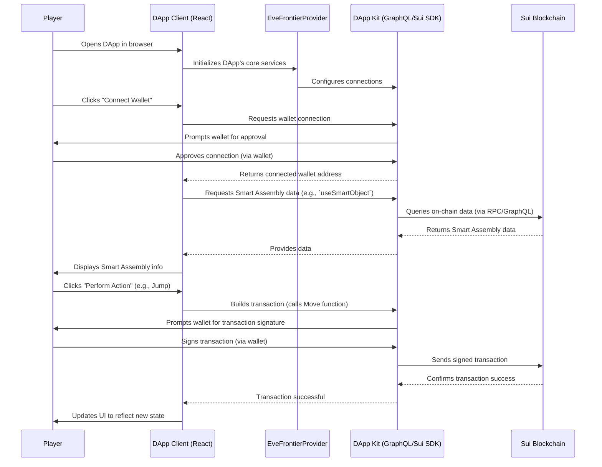

# Chapter 6: DApp Client (Frontend)

Welcome back, builder! In [Chapter 5: Docker Development Environment](05_docker_development_environment_.md), you set up your powerful, isolated "workbench" – a Docker container where you can run the EVE Frontier World, deploy your custom [Move Contracts & Extensions](02_move_contracts___extensions_.md), and execute your [TypeScript Interaction Scripts](03_typescript_interaction_scripts_.md). You're ready to build!

But there's one piece still missing from the puzzle: how do actual *players* interact with the incredible game world and custom features you're creating? Players don't want to type complex blockchain commands or run TypeScript scripts in a terminal. They want a friendly, visual interface – a game client they can open in their web browser.

This is where the **DApp Client (Frontend)** comes in!

## The Problem: Connecting Players to the Blockchain World

Imagine you've successfully deployed a [Smart Storage Unit](01_eve_frontier_world__smart_assemblies__.md) with a custom [Extension](02_move_contracts___extensions_.md) that allows players to deposit unique items. How does a player, sitting at their computer, open their digital wallet, see their items, and click a "Deposit" button that actually sends items to your on-chain storage unit?

The answer is a **Decentralized Application (DApp) Client**, often just called a "Frontend." It's the visual part of your blockchain application, the bridge between a player's browser and the underlying Sui blockchain.

## What is the DApp Client (Frontend)?

The `builder-scaffold` project provides a **pre-built web application template** for this purpose. It's like a starter kit for building the user interface of your EVE Frontier game or tool.

Here's what it does:

*   **User-Friendly Interface:** Provides a graphical layout (buttons, text, images) that makes interacting with the EVE Frontier World intuitive.
*   **Wallet Connection:** Enables players to securely connect their digital wallets (like Sui Wallet or EVE Vault) to the DApp. This is how the DApp gets permission to send transactions on their behalf.
*   **Data Display:** Fetches and shows information directly from the blockchain – for example, displaying a player's [Smart Character](01_eve_frontier_world__smart_assemblies__.md) details or the contents of their [Smart Storage Unit](01_eve_frontier_world__smart_assemblies__.md).
*   **Transaction Sending:** Translates player clicks (e.g., "Jump through gate," "Deposit Item") into actual blockchain transactions, which are then signed by the player's wallet and sent to the Sui network.

This template is built using **React** (a popular JavaScript library for building user interfaces) and is powered by `@evefrontier/dapp-kit`, a specialized library that simplifies connecting to the EVE Frontier World and the Sui blockchain.

## Your First Steps with the DApp Client

Let's use the DApp Client template provided in `builder-scaffold` to see how a player would connect their wallet and view information about their [Smart Assemblies](01_eve_frontier_world__smart_assemblies__.md).

### 1. Starting the DApp Client

First, make sure your [Docker Development Environment](05_docker_development_environment_.md) is running and your local Sui blockchain is active (as described in Chapter 5). You'll need an active local network for the DApp to connect to.

Then, open a *new* terminal or command prompt window (keep your Docker terminal running!). Navigate to the `dapps/` directory within your `builder-scaffold` project:

```bash
cd dapps/
pnpm install
pnpm dev
```

*What this does:*
*   `cd dapps/`: Changes your current directory to the `dapps/` folder, which contains the frontend project.
*   `pnpm install`: Installs all the necessary software packages and libraries (like React and `@evefrontier/dapp-kit`) that the DApp needs to run.
*   `pnpm dev`: Starts the DApp client in development mode. It will compile the React application and open it in your web browser, usually at `http://localhost:5173`.

You should see a web page pop up, looking like a basic web application with a "Connect Wallet" button.

### 2. Connecting Your Wallet

The first thing a player needs to do is connect their digital wallet. The DApp Client uses the `@evefrontier/dapp-kit` to handle this.

The `src/App.tsx` file contains the main application logic, including the wallet connection button.

```tsx
// dapps/src/App.tsx (simplified)
import { abbreviateAddress, useConnection } from "@evefrontier/dapp-kit";
import { useCurrentAccount } from "@mysten/dapp-kit-react";

function App() {
  const { handleConnect, handleDisconnect } = useConnection(); // Kit's connection hooks
  const account = useCurrentAccount(); // Sui DApp Kit's account hook

  return (
    // ... other UI elements ...
    <button
      onClick={() =>
        account?.address ? handleDisconnect() : handleConnect()
      }
    >
      {account ? abbreviateAddress(account?.address) : "Connect Wallet"}
    </button>
    // ...
  );
}

export default App;
```
*What this simplified code means:*
*   `useConnection()` from `@evefrontier/dapp-kit` provides functions like `handleConnect` and `handleDisconnect` that manage the connection process with a player's wallet.
*   `useCurrentAccount()` from `@mysten/dapp-kit-react` (which `@evefrontier/dapp-kit` uses internally) gives us information about the currently connected wallet, like its `address`.
*   The `onClick` handler checks if an `account` is already connected. If yes, it shows the abbreviated address and disconnects when clicked. If not, it shows "Connect Wallet" and initiates the connection.

When you click "Connect Wallet" in your browser, a pop-up from your installed Sui Wallet (or EVE Vault, if configured) will appear, asking you to approve the connection. Once approved, the button text will change to an abbreviated version of your wallet address, confirming the connection.

### 3. Displaying Smart Assembly Information

Now that your wallet is connected, the DApp can fetch and display data from the EVE Frontier World. The `builder-scaffold` template includes a component (`AssemblyInfo.tsx`) that shows details about a specific [Smart Assembly](01_eve_frontier_world__smart_assemblies__.md).

```tsx
// dapps/src/AssemblyInfo.tsx (simplified)
import { useSmartObject } from "@evefrontier/dapp-kit";

export function AssemblyInfo() {
  /**
   * useSmartObject() uses VITE_ITEM_ID / URL params and the kit's GraphQL.
   * Returns assembly, character, loading, error, refetch.
   */
  const { assembly, character, loading, error } = useSmartObject();

  if (loading) return <div>Loading assembly...</div>;
  if (error) return <div>Error: {error}</div>;
  if (!assembly) return <div>No assembly found</div>;

  return (
    <div>
      <p>Name: {assembly.name || assembly.typeDetails?.name}</p>
      <p>Type: {assembly.type}</p>
      <p>State: {assembly.state}</p>
      <p>ID: {assembly.id}</p>
      {character && <p>Owner: {character.name}</p>}
    </div>
  );
}
```
*What this simplified code means:*
*   `useSmartObject()` from `@evefrontier/dapp-kit` is a powerful "hook" (a React feature). It automatically connects to the EVE Frontier GraphQL API (which reads data from the Sui blockchain) to fetch details about a specific [Smart Assembly](01_eve_frontier_world__smart_assemblies__.md).
*   It handles `loading` states, `error` conditions, and finally provides the `assembly` object (containing name, type, state, ID) and the `character` object (for the owner).
*   The component then renders these details on the web page. This is how a player sees their character's name, or the details of a [Smart Gate](01_eve_frontier_world__smart_assemblies__.md) they are interacting with.

This process demonstrates how the DApp Client provides a visual representation of the on-chain world you've built.

## Under the Hood: How the DApp Client Connects It All

Let's look at how the DApp Client orchestrates all these connections, from your browser to the blockchain.

### High-Level Flow: From Click to Blockchain Action

Here’s a conceptual overview of what happens when a player interacts with the DApp:

1.  **Open DApp:** The player opens the DApp in their web browser.
2.  **Initialize Connection:** The DApp, specifically the `EveFrontierProvider`, sets up connections to the Sui blockchain and the EVE Frontier's data services (like GraphQL).
3.  **Connect Wallet:** The player clicks "Connect Wallet." The DApp uses the `@evefrontier/dapp-kit` to prompt the player's installed digital wallet (e.g., Sui Wallet) for connection approval.
4.  **Fetch Data:** Once connected (or when the page loads), the DApp uses hooks like `useSmartObject()` to send queries to the EVE Frontier's data service, which in turn queries the Sui blockchain.
5.  **Display Information:** The fetched data about [Smart Assemblies](01_eve_frontier_world__smart_assemblies__.md) is rendered visually in the DApp.
6.  **Player Action:** The player clicks a button to perform an action (e.g., "Jump").
7.  **Build Transaction:** The DApp uses `@evefrontier/dapp-kit` to construct a blockchain transaction based on the player's action, targeting specific [Move Contracts](02_move_contracts___extensions_.md) on the Sui blockchain.
8.  **Sign & Send:** The DApp sends this transaction to the player's wallet for approval. The player signs it, and the wallet sends it to the Sui blockchain.
9.  **Blockchain Processes:** The Sui blockchain executes the transaction, updating the state of the relevant [Smart Assemblies](01_eve_frontier_world__smart_assemblies__.md).
10. **DApp Updates:** The DApp observes these changes (e.g., by automatically refetching data) and updates its display to reflect the new on-chain state.

Here's a simplified sequence diagram:



### Key DApp Client Components

Let's look at the core components of the `builder-scaffold`'s DApp Client template:

#### 1. `EveFrontierProvider`: The Central Wrapper

In `src/main.tsx`, the entire application is wrapped by `EveFrontierProvider`. This is the most important component because it sets up all the necessary connections and services for your DApp.

```tsx
// dapps/src/main.tsx (simplified)
import ReactDOM from "react-dom/client";
import { QueryClient } from "@tanstack/react-query";
import App from "./App.tsx";
import { EveFrontierProvider } from "@evefrontier/dapp-kit";
import { Theme } from "@radix-ui/themes";

const queryClient = new QueryClient();

ReactDOM.createRoot(document.getElementById("root")!).render(
  <React.StrictMode>
    <Theme appearance="dark">
      {/* This wraps the entire app and sets up connections */}
      <EveFrontierProvider queryClient={queryClient}>
        <App />
      </EveFrontierProvider>
    </Theme>
  </React.StrictMode>,
);
```
*What this simplified code means:* `EveFrontierProvider` is like the main power hub for your DApp. It automatically provides:
*   **Sui Wallet Integration:** Connecting to wallets like Sui Wallet.
*   **GraphQL Data:** Access to the EVE Frontier's GraphQL API for reading complex on-chain data.
*   **React Query:** A powerful data-fetching library that helps manage loading states, caching, and automatic updates.
*   **Notifications:** Simple pop-up messages (toasts) for user feedback.

By wrapping `App` with `EveFrontierProvider`, any component inside your DApp can easily access these services using hooks like `useConnection()` or `useSmartObject()`.

#### 2. `useConnection()` and `useCurrentAccount()`: Wallet State

As seen in `src/App.tsx`, these hooks are fundamental for managing the player's wallet connection status.

*   `useConnection()` (`@evefrontier/dapp-kit`): Manages the actual connection and disconnection process, bridging to the underlying wallet.
*   `useCurrentAccount()` (`@mysten/dapp-kit-react`): Provides information about the currently active wallet account, such as its public address. This is how the DApp knows *who* is connected.

Together, they allow the DApp to display the player's address, and enable them to interact with the game world using their specific on-chain identity (their [Smart Character](01_eve_frontier_world__smart_assemblies__.md)).

#### 3. `useSmartObject()`: Fetching Smart Assembly Data

The `useSmartObject()` hook in `src/AssemblyInfo.tsx` is a prime example of how the DApp Client fetches and displays complex on-chain data in a user-friendly way.

Instead of writing custom blockchain queries, this hook:
*   Takes configuration (like the ID of the `Smart Assembly` to fetch, often from a URL parameter or environment variable).
*   Uses the `@evefrontier/dapp-kit` to internally send a GraphQL query to the EVE Frontier data service.
*   Processes the result, providing you with a neatly structured `assembly` object (and its `character` owner, if applicable).
*   Handles loading and error states, making your UI development much simpler.

This abstraction means you don't need to understand the intricate details of [Object ID Derivation](04_object_id_derivation_.md) or raw Sui RPC calls just to display basic information; the kit handles it for you.

## Conclusion

You've successfully explored the **DApp Client (Frontend)**! You now understand that it's the user-friendly web interface that allows players to seamlessly connect their wallets, view data about [Smart Assemblies](01_eve_frontier_world__smart_assemblies__.md) from the EVE Frontier World, and send transactions to the Sui blockchain. You've seen how `builder-scaffold` provides a React template powered by `@evefrontier/dapp-kit` to simplify this process, from wallet connection with `useConnection()` to displaying on-chain data with `useSmartObject()`.

This frontend acts as the crucial link between your amazing on-chain creations and the players who will experience them. In the next chapter, we'll dive into an advanced but powerful concept that enhances player security and onboarding: **zkLogin (Zero-Knowledge Login)**, which allows players to use familiar web2 logins (like Google) to interact with your DApp.

[Next Chapter: zkLogin (Zero-Knowledge Login)](07_zklogin__zero_knowledge_login__.md)

---

<sub><sup>Generated by [AI Codebase Knowledge Builder](https://github.com/The-Pocket/Tutorial-Codebase-Knowledge).</sup></sub> <sub><sup>**References**: [[1]](https://github.com/evefrontier/builder-scaffold/blob/ebc321a760e3701954e3d445fa92fe881267ea94/dapps/readme.md), [[2]](https://github.com/evefrontier/builder-scaffold/blob/ebc321a760e3701954e3d445fa92fe881267ea94/dapps/src/App.tsx), [[3]](https://github.com/evefrontier/builder-scaffold/blob/ebc321a760e3701954e3d445fa92fe881267ea94/dapps/src/AssemblyInfo.tsx), [[4]](https://github.com/evefrontier/builder-scaffold/blob/ebc321a760e3701954e3d445fa92fe881267ea94/dapps/src/main.tsx)</sup></sub>