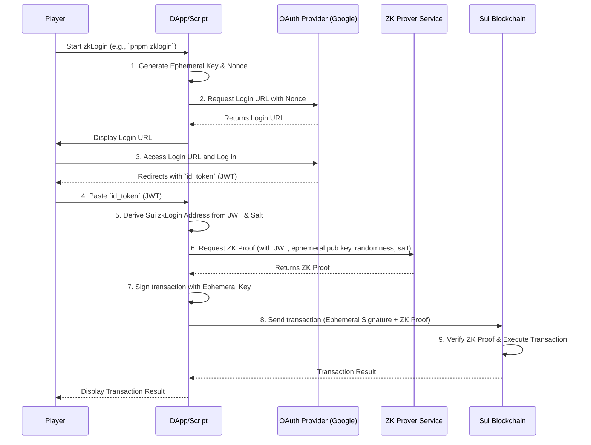

# Chapter 7: zkLogin (Zero-Knowledge Login)

Welcome back, builder! In [Chapter 6: DApp Client (Frontend)](06_dapp_client__frontend__.md), you learned how to build a friendly web interface for players to interact with your EVE Frontier World, connecting their crypto wallets to perform on-chain actions.

But let's be honest: for many new players, the concept of a "crypto wallet," "private keys," or "seed phrases" can be a major hurdle. It's unfamiliar, feels technical, and might even be intimidating. What if we could remove that barrier and let players use something they already know and trust, like their Google or Discord account, to play your blockchain game?

This is where **zkLogin (Zero-Knowledge Login)** comes in! It's a game-changer for user onboarding and makes interacting with the blockchain as simple as logging into any regular website.

## The Problem: The Crypto Wallet Barrier

Imagine trying to get your friends into your amazing new EVE Frontier game. You tell them, "Just download a Sui Wallet, write down your 12-word seed phrase, remember your password, and then connect it to the game!" Many would likely say, "Nah, too complicated."

Traditional crypto wallets, while secure, introduce friction for everyday users. They are a big reason why many people are hesitant to try blockchain applications.

## The Solution: Seamless Social Logins with zkLogin

**zkLogin** is an advanced authentication method that solves this problem. It allows players to sign blockchain transactions using their existing social logins (like Google or Discord) instead of needing a separate crypto wallet.

Think of it this way:

*   **Traditional Web2 Login:** You log into Google, Google verifies you, and you access your email.
*   **Traditional Web3 Login:** You log into your crypto wallet, your wallet signs a transaction, and that transaction goes to the blockchain.
*   **zkLogin:** You log into Google, and *that Google login* directly empowers you to sign blockchain transactions for your EVE Frontier character!

It achieves this magic using something called **Zero-Knowledge Proofs**. Don't worry about the complex math behind it; for now, just know that a Zero-Knowledge Proof is a special cryptographic technique that allows one party to prove to another that a statement is true, *without revealing any information beyond the validity of the statement itself.*

In simpler terms, zkLogin lets you **prove you own your Google account** to the Sui blockchain, without ever telling the blockchain *your Google password* or any other sensitive personal data. This proof then acts like a "virtual ID card" that authorizes your blockchain actions.

## Why is This a Game Changer for Builders?

*   **Massive User Onboarding:** Attract a much wider audience who are familiar with social logins but new to crypto.
*   **Simpler User Experience:** No more dealing with private keys or seed phrases for basic interactions.
*   **Enhanced Security (for users):** Users' blockchain interactions are secured by their trusted social login provider (Google, Discord, etc.), rather than needing to manage complex private keys themselves.
*   **Persistent Identity:** Even without a traditional wallet, a user's social login maps to a *stable, unique Sui address* on the blockchain. This means their EVE Frontier [Smart Character](01_eve_frontier_world__smart_assemblies__.md) and assets are always associated with them.

## Your First zkLogin Transaction: A Practical Walkthrough

Let's use the `builder-scaffold`'s `zklogin` helper script to experience zkLogin firsthand. This script will guide you through the process of logging in with your social account and executing a test transaction on the Sui blockchain, all without a traditional wallet!

### Prerequisites

*   **Node.js (version 22 or higher) and `pnpm`:** These are required to run the TypeScript script. (If you're using the [Docker Development Environment](05_docker_development_environment_.md) from Chapter 5, these are already set up within your Docker container, but for this specific `zklogin` helper, it's often run directly on the host for convenience. Ensure `Node.js >=22` and `pnpm` are installed globally on your host machine.)
*   **An active internet connection:** To connect to the OAuth provider and the ZK Prover.

### Running the zkLogin Helper Script

Open your terminal or command prompt, navigate to the `zklogin/` directory within your `builder-scaffold` project, and run these commands:

```bash
cd zklogin
pnpm install
pnpm zklogin
```

*What this does:*
*   `cd zklogin`: Changes your directory to the `zklogin/` folder.
*   `pnpm install`: Installs the necessary Node.js packages for the script.
*   `pnpm zklogin`: Executes the main `zkLoginTransaction.ts` script.

The script will now guide you through a few steps:

#### Step 1: Generating Ephemeral Credentials and Login URL

The script first generates some temporary (ephemeral) cryptographic credentials and a special "nonce" to secure your login. It then constructs a unique URL for you to log in with your social provider.

You'll see output similar to this:

```
🚀 zkLogin Transaction Script
══════════════════════════════════════════════════

📝 Step 1: Generating ephemeral credentials...
   ✓ Ephemeral keypair created
   ✓ Max epoch: 1000
   ✓ Randomness generated

🔗 Step 2: Login URL generated

   Open this URL in your browser to log in:

   https://test.auth.evefrontier.com/oauth2/authorize?client_id=00d3ce5b...&redirect_uri=https%3A%2F%2Fwww.sui.io&nonce=eyJ...

══════════════════════════════════════════════════

   After logging in, you'll be redirected to sui.io
   Copy the 'id_token' value from the URL fragment.
```

#### Step 2: Logging In Via Your Browser

1.  **Copy the URL:** Copy the long URL displayed in your terminal (the one starting with `https://test.auth.evefrontier.com/...`).
2.  **Open in Browser:** Paste this URL into your web browser.
3.  **Login:** You'll be redirected to a social login provider (e.g., Google or Discord, depending on the `AUTH_URL` configuration in `zkLoginTransaction.ts`). Log in with your preferred account.
4.  **Redirect to `sui.io`:** After a successful login, your browser will redirect to `https://www.sui.io`. Look carefully at the URL in your browser's address bar; it will contain a long string after `#id_token=`.
    *   Example: `https://www.sui.io/#id_token=eyJhbGciOiJSUzI1NiIsIng...`
5.  **Copy the `id_token`:** Copy the entire string that comes *after* `#id_token=` (this is your JWT, or JSON Web Token).

#### Step 3: Pasting the JWT and Checking Balance

Go back to your terminal. The script is waiting for your input.

```
📋 Paste your JWT token here:
```

1.  **Paste JWT:** Paste the `id_token` you copied from your browser into the terminal and press Enter.
2.  **Balance Check:** The script will then use this JWT to calculate your unique Sui address for zkLogin and check its SUI balance on the `devnet` (the default network). If your address has no SUI, it will automatically request some from the `devnet` faucet so you can pay for gas fees.

```
📋 Paste your JWT token here: eyJhbGciOiJSUzI1NiIsIng... (your very long JWT)

══════════════════════════════════════════════

⚙️  Step 3: Checking balance...

📍 Your zkLogin address: 0x...your_sui_zklogin_address...
(Make sure this address has SUI for gas fees)

SUI balance: 0
No current balance
Requesting balance
Requested balance from faucet. Digest: A1B2C3D4E5F6...
```

#### Step 4: Fetching ZK Proof and Executing a Test Transaction

The script will now fetch the necessary Zero-Knowledge Proof (this is a one-time step for the current ephemeral session) and then present you with the ability to execute transactions.

```
🔐 Fetching ZK proof (one-time)...
   ✓ ZK proof cached

⚙️  Test transaction bytes:
 1,2,3,4,5... (example test transaction bytes)

══════════

⚙️  Step 4: Ready to execute transactions
   Type 'exit' or 'quit' to stop

📋 Paste transaction bytes, 'test' to generate new tx bytes or 'exit' to quit:
```

1.  **Execute Test:** Type `test` and press Enter. The script will generate a new set of test transaction bytes and execute them.

```
📋 Paste transaction bytes, 'test' to generate new tx bytes or 'exit' to quit: test

⚙️  Test transaction bytes:
 10,20,30,40,50... (new example test transaction bytes)

══════════

📤 Executing transaction...

✅ Transaction completed!
   Digest: AABBCCDDEEFF...
   Status: Some_Effect_Details

✅ Ready for next transaction

══════════
```

Congratulations! You've just signed and executed a blockchain transaction on the Sui `devnet` using nothing but your social login. You never needed a traditional crypto wallet or a seed phrase!

You can keep typing `test` to send more transactions, or `exit` to quit the script.

## Under the Hood: How zkLogin Works Its Magic

Let's demystify what happened during that interactive session. zkLogin is a sophisticated multi-step process that combines web2 authentication (your social login) with web3 cryptography (Zero-Knowledge Proofs).

Here's a simplified sequence of events when you use zkLogin:



Let's break down the key technical components within the `zklogin/zkLoginTransaction.ts` script.

### 1. Generating Ephemeral Credentials (`generateUserDataForZkLogin`)

Before you even log in, the script creates some temporary cryptographic ingredients.

```typescript
// zklogin/zkLoginTransaction.ts (simplified)
import { Ed25519Keypair } from "@mysten/sui/keypairs/ed25519";
import { generateNonce, generateRandomness } from "@mysten/sui/zklogin";

const generateUserDataForZkLogin = async () => {
    // A temporary keypair that will only be used for this session
    const ephemeralKeyPair = new Ed25519Keypair();
    // A random value to add uniqueness
    const randomness = generateRandomness();
    // The maximum epoch (time period) for which the proof will be valid
    const maxEpoch = await calculateProofExpirationEpoch();

    // A 'nonce' is a "number used once" to prevent replay attacks
    const nonce = generateNonce(ephemeralKeyPair.getPublicKey(), maxEpoch, randomness);

    return {
        ephemeralKeyPair, // Used for temporary signing
        maxEpoch,         // Expiration of the proof
        randomness,       // Used in proof generation
        nonce,            // Used in the login URL
    };
};
```
*What this simplified code means:* This function prepares the core temporary secrets:
*   `ephemeralKeyPair`: A brand-new, short-lived key pair. It will be used to *sign* your transaction, but this signature isn't enough on its own.
*   `randomness`: A random number.
*   `maxEpoch`: An expiration timestamp (in Sui epochs). Your ZK Proof will only be valid until this epoch.
*   `nonce`: A unique string generated from the ephemeral public key, `maxEpoch`, and `randomness`. This `nonce` is crucial; it's included in the social login URL and ensures that the `id_token` (JWT) you get back is specifically linked to *this* zkLogin session and *these* ephemeral credentials.

### 2. Creating the Login URL (`createLoginUrl`)

The `nonce` is then embedded into a standard OAuth 2.0 login URL, which points to your chosen social login provider (e.g., Google or, in this `builder-scaffold` example, "EVE Frontier OAuth").

```typescript
// zklogin/zkLoginTransaction.ts (simplified)
const AUTH_URL = "https://test.auth.evefrontier.com"; // The social login provider
const CLIENT_ID = "00d3ce5b..."; // Your DApp's registered ID with the provider

const createLoginUrl = (nonce: string): string => {
    const redirectURL = encodeURIComponent("https://www.sui.io");
    return `${AUTH_URL}/oauth2/authorize?client_id=${CLIENT_ID}&response_type=id_token&scope=openid&redirect_uri=${redirectURL}&nonce=${nonce}`;
};
```
*What this simplified code means:* This function builds the URL you open in your browser. When you log in, the social provider confirms your identity and then redirects you back to the `redirectURL` (in this case, `https://www.sui.io`), appending your `id_token` (JWT) and the original `nonce`. The `id_token` is a digitally signed receipt proving your successful login.

### 3. Deriving Your Sui zkLogin Address (`jwtToAddress`)

Once you have the `id_token` (JWT) from your social login, a crucial step is to figure out your unique, stable Sui address for zkLogin. This address is deterministically derived from your JWT and a `USER_SALT`.

```typescript
// zklogin/zkLoginTransaction.ts (conceptual)
import { jwtToAddress, genAddressSeed } from "@mysten/sui/zklogin";

// USER_SALT is a fixed value for devnet, but would come from Enoki for testnet/mainnet.
const USER_SALT = "000000";

// This function (used internally by the script) calculates your Sui address:
// const zkLoginUserAddress = jwtToAddress(jwt, USER_SALT, false);
```
*What this conceptual code means:* The `jwtToAddress` function takes your `id_token` (JWT) and a `USER_SALT` (a unique string) to calculate a consistent Sui address. This is the address that will own your EVE Frontier [Smart Character](01_eve_frontier_world__smart_assemblies__.md) and assets. It's stable, meaning it will always be the same every time you log in with that specific social account and `USER_SALT`.

### 4. Getting the Zero-Knowledge Proof (`getProof`)

This is where the "zero-knowledge" magic happens. The `id_token` (JWT) itself is too sensitive to put directly on the blockchain. Instead, we ask a **ZK Prover service** to generate a mathematical proof that demonstrates you possess a valid `id_token` for the current `nonce` and `ephemeralKeyPair`, without revealing the `id_token` itself.

```typescript
// zklogin/zkLoginTransaction.ts (simplified)
import axios from "axios";
import { getExtendedEphemeralPublicKey } from "@mysten/sui/zklogin";

// PROVER_URL for devnet, but needs to be Enoki for testnet/mainnet
const PROVER_URL = "https://prover-dev.mystenlabs.com/v1";
const USER_SALT = "000000"; // Fixed for devnet

const getProof = async (
    jwt: string,
    ephemeralKeyPair: Ed25519Keypair,
    maxEpoch: number,
    randomness: string
) => {
    const extendedEphemeralPublicKey = getExtendedEphemeralPublicKey(
        ephemeralKeyPair.getPublicKey()
    );

    // Send the JWT, ephemeral public key, maxEpoch, randomness, and salt to the ZK Prover
    const zkProofResult = await axios.post(PROVER_URL, {
        jwt,
        extendedEphemeralPublicKey,
        maxEpoch,
        jwtRandomness: randomness,
        salt: USER_SALT,
        keyClaimName: "sub", // A standard JWT field
    });

    return zkProofResult.data; // This data is the Zero-Knowledge Proof!
};
```
*What this simplified code means:* The script sends the `id_token` (JWT) and your ephemeral public key to a `PROVER_URL` (a dedicated ZK Prover service). The prover verifies the JWT, checks its validity against the `nonce` (which was derived from the ephemeral key, `maxEpoch`, and `randomness`), and then generates the actual Zero-Knowledge Proof. This proof is a compact cryptographic statement that the Sui blockchain can quickly verify.

**Important Note on Prover and Salt:** The `PROVER_URL` and `USER_SALT` in this example are configured for Sui `devnet`. For `testnet` or `mainnet` deployments, you would typically use a service like [Enoki](https://portal.enoki.mystenlabs.com/) (from Mysten Labs) to obtain the `USER_SALT` and the ZK Proof, as the devnet prover is not suitable for production environments.

### 5. Executing the Transaction (`executeTxn`)

Finally, with the ephemeral key's signature and the Zero-Knowledge Proof in hand, the transaction can be sent to the Sui blockchain.

```typescript
// zklogin/zkLoginTransaction.ts (simplified)
import { Transaction } from "@mysten/sui/transactions";
import { getZkLoginSignature, jwtToAddress, genAddressSeed } from "@mysten/sui/zklogin";
import { jwtDecode, type JwtPayload } from "jwt-decode";

const executeTxn = async (
    txBytes: Uint8Array,
    jwt: string,
    ephemeralKeyPair: Ed25519Keypair,
    maxEpoch: number,
    proof: Record<string, unknown> // The ZK Proof we got earlier
) => {
    const decodedJwt = jwtDecode(jwt) as JwtPayload;
    // The ephemeral key signs the transaction bytes
    const signedBytes = await ephemeralKeyPair.signTransaction(txBytes);

    // Generate the address seed, necessary for the zkLogin signature
    const addressSeed: string = genAddressSeed(
        BigInt(USER_SALT), "sub", decodedJwt.sub!, decodedJwt.aud!
    ).toString();

    // Combine the ephemeral signature with the ZK Proof and other inputs
    const zkLoginSignature = getZkLoginSignature({
        inputs: {
            ...proof, // The actual ZK Proof
            addressSeed, // The seed used to derive the Sui address
        },
        maxEpoch,
        userSignature: signedBytes.signature, // The signature from the ephemeral key
    });

    console.log("📤 Executing transaction...\n");

    // Send the transaction bytes and the combined zkLogin signature to Sui
    const res = await suiClient.core.executeTransaction({
        transaction: new Uint8Array(Buffer.from(signedBytes.bytes, "base64")),
        signatures: [zkLoginSignature],
    });

    // ... handle result ...
};
```
*What this simplified code means:*
*   The `ephemeralKeyPair` signs the transaction, just like a regular wallet key.
*   However, this signature alone isn't enough. It's combined with the `proof` (the Zero-Knowledge Proof) and other metadata (like `maxEpoch` and `addressSeed`) into a special `zkLoginSignature`.
*   This `zkLoginSignature` is then sent to the Sui blockchain along with the transaction. The Sui blockchain validates this special signature: it verifies the ZK Proof (that you truly logged into your social account) and confirms that the `ephemeralKeyPair` used to sign the transaction is linked to that proof. If everything matches, the transaction is executed.

This is the entire chain of trust: your social login proves you are you, the ZK Prover creates an unforgeable "virtual ID card" (the ZK Proof), and your temporary ephemeral key provides the actual transaction signature.

## Conclusion

You've successfully journeyed into the exciting world of **zkLogin**! You now understand how this powerful technology breaks down the barriers of traditional crypto wallets, allowing players to use their familiar social logins (like Google or Discord) to interact directly with your EVE Frontier World on the Sui blockchain. You've walked through the practical steps of performing a zkLogin transaction and gained insight into the underlying process involving ephemeral keys, Zero-Knowledge Proofs, and the secure verification by the Sui network.

zkLogin is a crucial step towards making blockchain games and DApps accessible to a mainstream audience, empowering you, the builder, to create truly inclusive and user-friendly experiences in the EVE Frontier!

---

<sub><sup>Generated by [AI Codebase Knowledge Builder](https://github.com/The-Pocket/Tutorial-Codebase-Knowledge).</sup></sub> <sub><sup>**References**: [[1]](https://github.com/evefrontier/builder-scaffold/blob/ebc321a760e3701954e3d445fa92fe881267ea94/zklogin/readme.md), [[2]](https://github.com/evefrontier/builder-scaffold/blob/ebc321a760e3701954e3d445fa92fe881267ea94/zklogin/zkLoginTransaction.ts)</sup></sub>