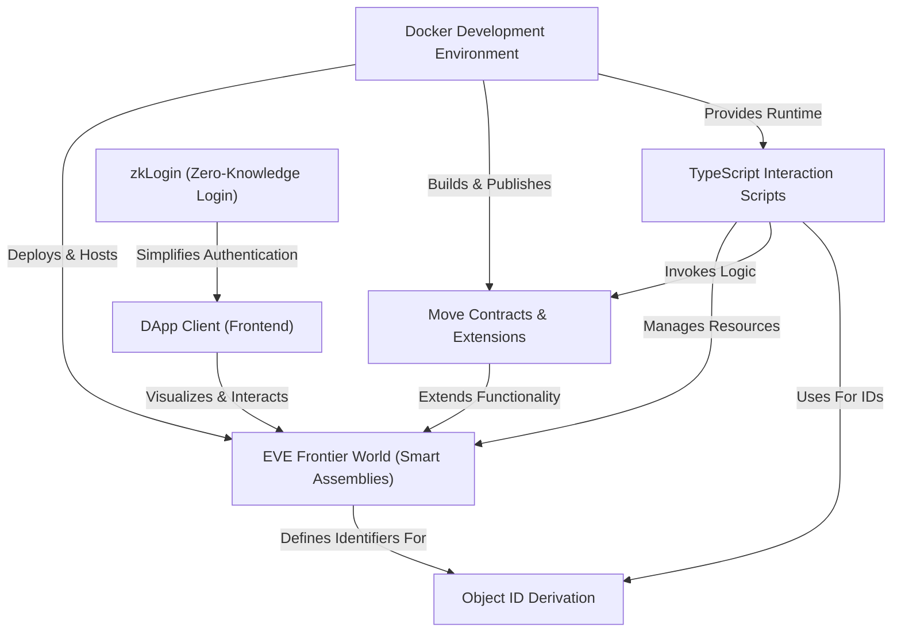

# [Tutorial: builder-scaffold](https://code2tutorial.com/tutorial/5b75ded7-a6d8-4c87-96ea-5346043332dd/index.md)

The `builder-scaffold` project is a comprehensive toolkit designed to help developers *build and extend* the **EVE Frontier World**, a blockchain-based game on Sui. It provides templates for creating custom *game logic* using Move contracts, automating interactions with TypeScript scripts, and developing user-facing DApps. The project also offers a **ready-to-use Docker environment** and integrates *zkLogin* for seamless social logins to the blockchain.

## Visual Overview

## Chapters

1. [EVE Frontier World (Smart Assemblies)
](01_eve_frontier_world__smart_assemblies__.md)
2. [Move Contracts & Extensions
](02_move_contracts___extensions_.md)
3. [TypeScript Interaction Scripts
](03_typescript_interaction_scripts_.md)
4. [Object ID Derivation
](04_object_id_derivation_.md)
5. [Docker Development Environment
](05_docker_development_environment_.md)
6. [DApp Client (Frontend)
](06_dapp_client__frontend__.md)
7. [zkLogin (Zero-Knowledge Login)
](07_zklogin__zero_knowledge_login__.md)

---

Generated by [AI Codebase Knowledge Builder](https://github.com/The-Pocket/Tutorial-Codebase-Knowledge).