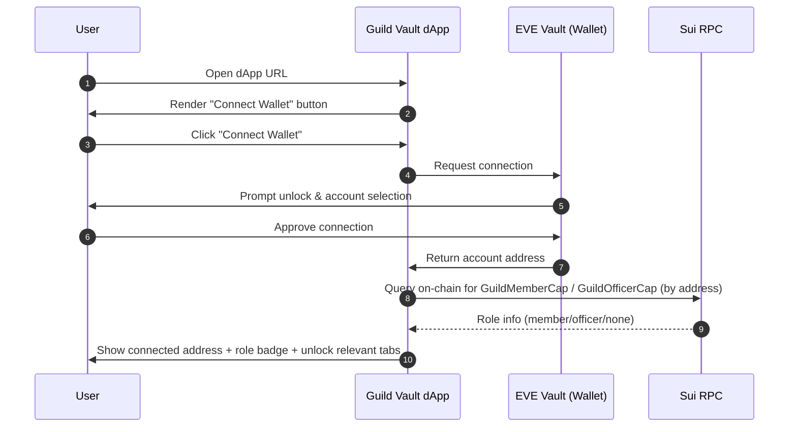
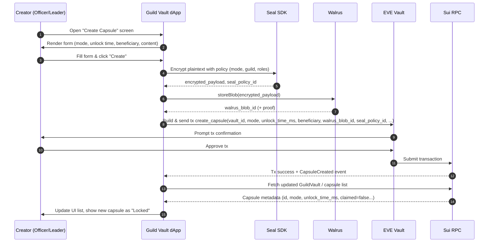
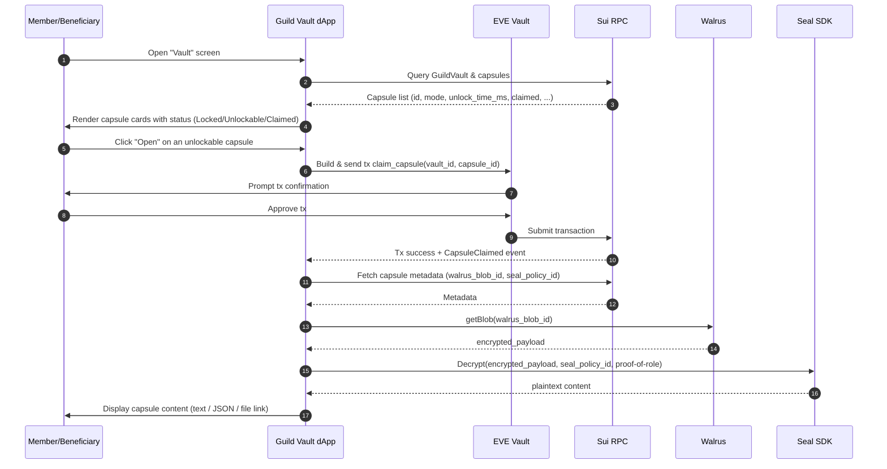
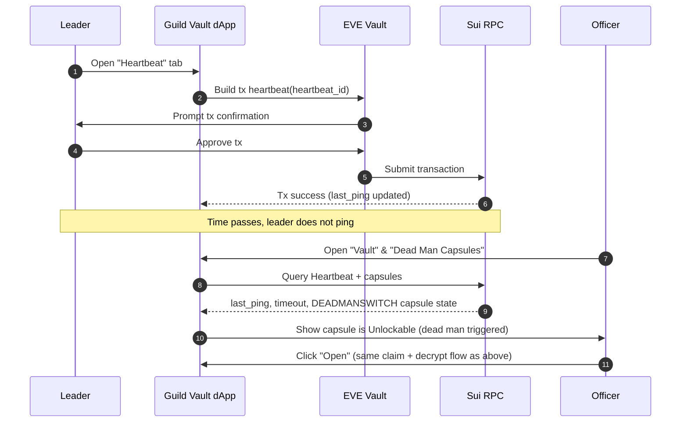

# Guild Time Vault – UX & User Flows

## 1. Sequence Diagrams (Mermaid)

### 1.1. Connect Wallet & Detect Role

### 1.2. Create Capsule (ARCHIVE / PRIVATE_INHERIT / DEAD_MAN)

### 1.3. Claim & Open Capsule (ARCHIVE / PRIVATE_INHERIT)

### 1.4. Heartbeat & Dead Man’s Switch (tóm tắt)

---

## 2. UI Wireframe-Level Checklist

### 2.1. Global Layout

- Header:
  - Logo / tên dApp: **Guild Time Vault**.
  - Network badge: Hackathon / Testnet.
  - Wallet area:
    - Khi chưa connect: nút **"Connect EVE Vault"**.
    - Khi đã connect: địa chỉ rút gọn + icon copy.
- Navigation (tabs hoặc sidebar):
  - `Vault` (dashboard capsules).
  - `Create Capsule`.
  - `Members` (admin roles).
  - `Heartbeat`.
  - (Optional) `Settings`.

---

### 2.2. Screen: Connect & Role Indicator

**Mục tiêu:** user biết mình đã connect chưa và đang ở role nào.

Elements:

- Wallet card:
  - State 1 (disconnected):
    - Title: "Wallet".
    - Button: **Connect EVE Vault**.
  - State 2 (connected):
    - Label: `Connected as: 0xABCD...`.
    - Copy icon.
- Role badge:
  - Text: `Role: Leader / Officer / Member / Guest`.
  - Badge màu khác nhau cho từng role.
- Guild context:
  - `Guild ID: 0x...` (hoặc tên nếu có).
  - `Vault ID: 0x...` rút gọn.

---

### 2.3. Screen: Vault (Capsule Dashboard)

**Mục tiêu:** hiển thị danh sách capsule + trạng thái + action.

**Filter bar:**

- Dropdown `Mode`:
  - All / Archive / Inheritance / Dead Man.
- Toggle `Show claimed` (On/Off).

**Capsule list (grid hoặc list):**

- Với mỗi capsule card:
  - Title (hoặc `Capsule #ID`).
  - Mode badge: `ARCHIVE / PRIVATE INHERIT / DEAD MAN`.
  - Unlock info:
    - "Unlocks at: {dateTime}".
    - Status label: `Locked / Unlockable / Claimed`.
  - Beneficiary (nếu có): `Beneficiary: 0x...`.
  - Icons nhỏ:
    - Dead‑man icon nếu mode DEADMANSWITCH.
  - Action zone:
    - Button **Open** (enabled/disabled tuỳ trạng thái & quyền).
    - Tooltip cho case disabled: "Too early", "No permission".

**Optional detail panel (side drawer/modal):**

- Khi click vào một capsule:
  - Info: ID đầy đủ, creator, createdAt.
  - History: danh sách event (Created, Claimed, DeadManTriggered).

---

### 2.4. Screen: Create Capsule

**Mục tiêu:** form duy nhất để tạo mọi loại capsule.

**Section A – Mode selector:**

- Radio buttons:
  - `Archive (Guild Only)` – mô tả ngắn: "Mở cho mọi member sau thời điểm T".
  - `Private Inheritance` – "Chỉ 1 beneficiary được mở".
  - `Dead Man’s Switch` – "Mở khi leader không heartbeat trong N ngày".

**Section B – Unlock settings:**

- Cho ARCHIVE / PRIVATE_INHERIT:
  - DateTime picker: `Unlock at`.
  - Label hiển thị dạng friendly: `Unlocks in ~X days`.
- Cho DEADMANSWITCH:
  - Readonly text: `Unlocks when heartbeat expires (timeout: N days)`.

**Section C – Beneficiary (khi cần):**

- Input `Sui address`:
  - Placeholder: `0x...`.
  - Hiển thị error khi format sai.
- Optional: dropdown để chọn từ danh sách member (nếu bạn load được danh sách từ on‑chain).

**Section D – Content:**

- Textarea lớn:
  - Label: `Secret content / message`.
  - Placeholder: ví dụ "Chiến lược, lore, seed phụ, toạ độ kho báu...".
  - Char counter.
- (Phase sau) File upload (có thể để disabled / hidden trong MVP).

**Section E – Actions & feedback:**

- Primary button: **Create Capsule**.
- Secondary: **Cancel** / quay lại Vault.
- Loading state (sau khi bấm Create):
  - Progress text: `Encrypting with Seal...` → `Uploading to Walrus...` → `Submitting transaction...`.
- Error display:
  - Vùng text hiển thị lỗi từ Seal, Walrus, hoặc on‑chain (ví dụ: `Unlock time must be in the future`).

---

### 2.5. Screen: Capsule Detail / Open Result

**Mục tiêu:** hiển thị nội dung sau khi mở capsule.

Elements:

- Header:
  - Title / Capsule #ID.
  - Mode badge.
  - Status: `Claimed at {datetime}`.
- Metadata block:
  - `Creator: 0x...`.
  - `Guild: 0x...`.
  - `Unlock at: {datetime}`.
  - `Beneficiary: 0x...` (nếu có).
- Content panel:
  - Box scrollable chứa plaintext (đã decrypt).
  - Style cơ bản để đọc dễ (font, spacing).
- Optional advanced info (accordion):
  - `Walrus blob id: ...` (rút gọn).
  - `Seal policy id: ...`.
  - Link `View raw blob` (nếu public đủ).

---

### 2.6. Screen: Members (Admin)

**Mục tiêu:** leader/officer quản lý quyền.

**Section A – Grant role:**

- Input `Sui address`.
- Radio / select `Role`:
  - Member.
  - Officer.
- Button **Grant**.
- Inline feedback: `Granted MemberCap to 0x...` hoặc lỗi (không có OfficerCap, v.v.).

**Section B – Current members list:**

- Table với cột:
  - Address.
  - Role (badge).
  - Actions:
    - Button **Revoke** (nếu implement).
- Filter row:
  - Dropdown Role filter (All / Member / Officer).

---

### 2.7. Screen: Heartbeat

**Mục tiêu:** leader quản lý dead man’s switch.

**Heartbeat status card:**

- `Last ping: {datetime or "never"}`.
- `Timeout: N days`.
- `Status: Alive / Expired` (màu xanh/đỏ).

**Controls:**

- Button **Ping now** (gửi tx `heartbeat`).
- (Optional) Form nhỏ để chỉnh `Timeout`:
  - Numeric input `N days`.
  - Button **Update timeout**.

**Dead Man capsules summary:**

- List các capsule mode DEADMANSWITCH:
  - Capsule ID, created at, claimed yes/no.
  - Nút "Go to capsule" mở sang chi tiết.
